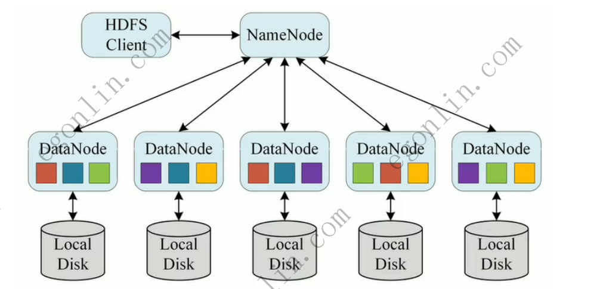
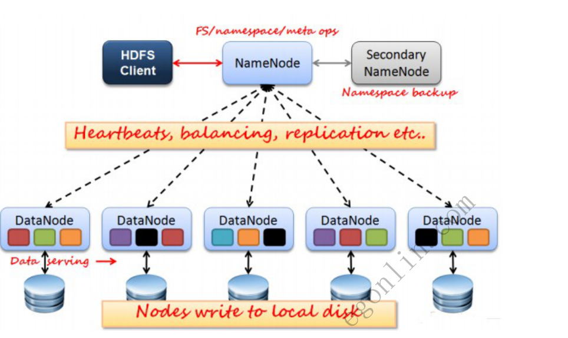
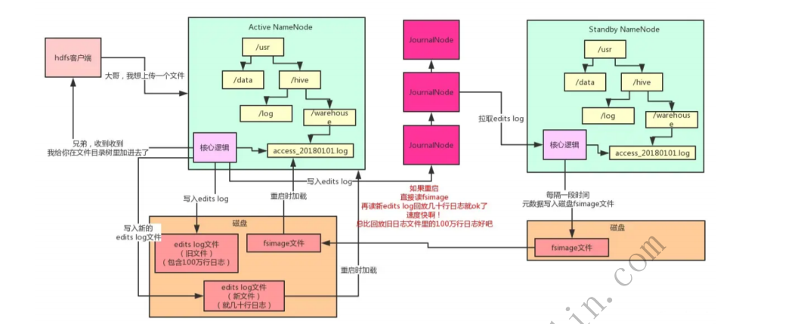
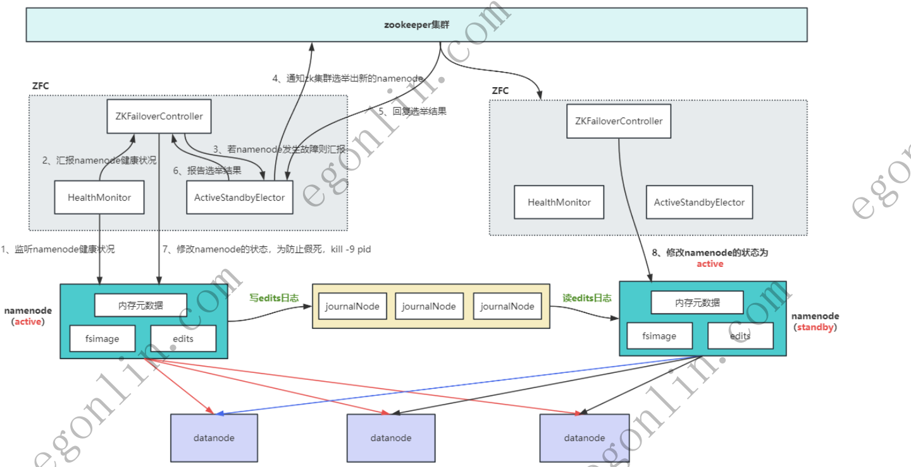
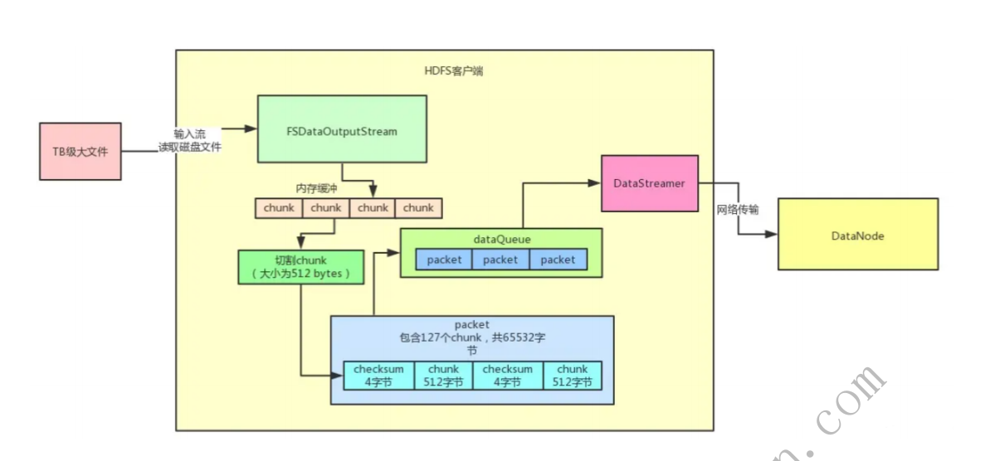
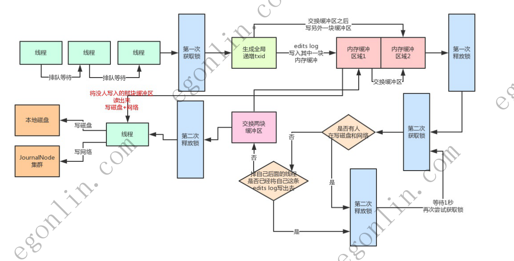
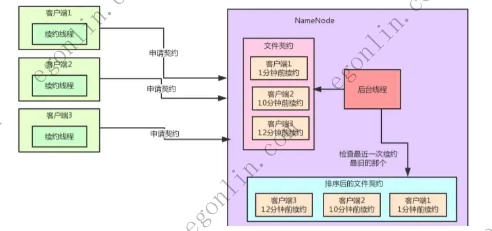
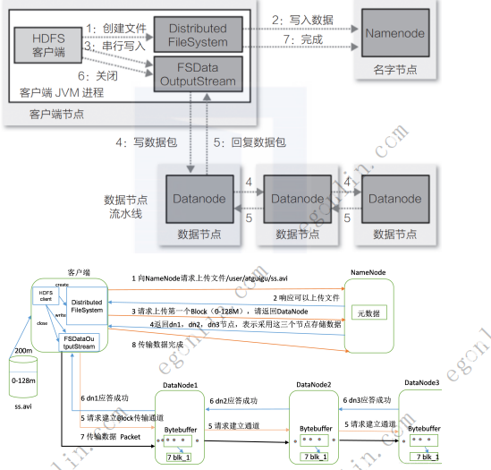
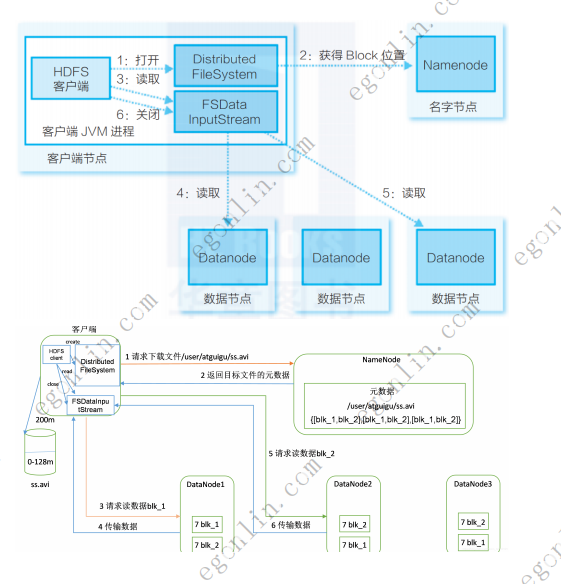

## 目录

| # | 章节 | 讲啥 |
|---|---|---|
| [1](#hadoop是什么) | **Hadoop 是什么** | 大数据框架的家庭成员 |
| [2](#hdfs) | **HDFS** | 什么是 HDFS + 怎么用 |
| [3](#hdfs架构) | **HDFS 架构** | 三大平面 + 颜色/线型/核心点 |
| [4](#nn如何确保元数据不丢) | **NN 如何确保元数据不丢** | fsimage + edits log + WAL |
| [5](#高可用架构) | **高可用架构** | ZK 选举 + ZKFC 切换 + JN 同步 |
| [6](#hdfs扛住高并发的关键) | **HDFS 扛住高并发的关键** | 分段加锁 + 双缓冲 + chunk/packet |
| [7](#hdfs-的文件契约机制) | **HDFS 的文件契约机制** | 客户端续约 + NN 后台检查 + 超时回收 |
| [8](#hdfs-读写流程) | **HDFS 读写流程** | 写:Client→pipeline;读:Client←最近 DN |

---

## Hadoop是什么
hadoop是目前 大数据领域最主流的 分布式计算框架
- HDFS
- 
- MapRuduce -> spark 框架
- Yarn

## HDFS
### 什么是 HDFS
HDFS(Hadoop Distributed File System)是 Hadoop 项目的核心子项目,**是负责存储的分布式文件系统**。它把一个文件切成若干块(默认 128MB),分散存储在多台机器上,并对外提供统一的访问接口。

如上图所示,老板要看几十个指标的报表 → 报表系统发起几百万行的大 SQL → SQL 被拆分成计算任务分发到多台机器上执行 → 每台机器本地都有 `DataNode` 进程和 2T 的磁盘文件 → 所有 DataNode 由 NameNode 统一管理。这就是典型的"**计算向数据迁移**"场景。

## HDFS架构


### 三大平面
HDFS 架构可以从上到下分成 **三个平面**,每个平面职责清晰分离:

#### ① 元数据 / 控制平面(顶部)
- **HDFS Client** ⇄ **NameNode**:红色双向箭头,标 `FS / namespace / meta ops`
  - 所有**元数据操作**(mkdir、ls、open、create、rename、setReplication…)都走 NameNode
- **NameNode** ⇄ **Secondary NameNode**:双向箭头,标 `Namespace backup`
  - SNN 周期性地把 NN 的 `edits log` 合并到 `fsimage`,**做 checkpoint**,起到备份/恢复点作用
  - ⚠️ **SNN 不是 NameNode 的热备**,NameNode 挂掉时它不能自动顶上

#### ② 管理平面(中间,核心纽带)
- 黄色横条 `Heartbeats, balancing, replication etc.`,从 NameNode 往下画了 **5 条虚线箭头** 指向 5 个 DataNode
- 虚线 ≠ 数据流,是**轻量级、周期性的控制信号**:
  - **Heartbeat**:DataNode 每 3 秒向 NN 报一次存活 + 块状态
  - **Block Report**:DataNode 周期性上报自己持有的所有 Block 列表
  - **Balancing**:NN 发现块分布不均时指挥 DN 互相迁移
  - **Replication**:某 DN 挂掉时 NN 触发副本补齐(从 3 副本变 2 → 立刻补成 3)
  - **Delete / Invalidate**:删除文件时通知相关 DN 删除 Block
  - **Recover**:损坏 Block 的修复指令

#### ② 数据平面(底部)
- 5 个 **DataNode** 横向排列,每个内部画了 3 个**不同颜色**的小方块(代表 Block)
- 每个 DataNode 下面连一个**磁盘图标**(圆柱),双向箭头
- 底部黄色条 `Nodes write to local disk`——强调 Block **就地落本地盘**,不经过 NN
- 最左边 DataNode 旁标了 `Data serving` + 红色箭头往左指回 Client——**数据流的终点是 Client**,DN 和 Client 走自己的数据通道,不经过 NN

### 颜色 / 排布的隐含语义
- **不同颜色 = 不同文件 / 不同 Block 组**
- **同一颜色在不同 DN 上出现 = 同一 Block 的多副本**(默认 3 副本策略)
  - 例:紫色出现在 DN1、DN4;红色出现在 DN1、DN2、DN4……正是**副本分散在多个 DN** 的直观示意
- **同一个 DN 上三色不重复** = 一个 DN 通常同时服务多个文件

### 三种线型的语义(读懂这张图的钥匙)
| 线型 | 含义 | 频率 / 代价 |
|---|---|---|
| **红色实线** | Client ↔ NN 的元数据 RPC | 低频,NN 是瓶颈 |
| **黑色实线** | DN ↔ 本地盘 / DN ↔ Client 的**数据流** | 高频、大流量 |
| **黑色虚线** | NN → DN 的**控制信令**(心跳、副本、均衡) | 高频、小包 |

### 这张图想强调的 4 个核心点
1. **NN 是"大脑",不存数据**——所有元数据集中在 NN,Block 本身全部落在 DN 的本地盘
2. **SNN 不是热备**——只做 namespace 备份,NN 挂掉它不能自动顶上(高可用要靠 JournalNode + ZooKeeper 选举)
3. **数据流不经过 NN**——Client 拿到 Block 位置后,直接和 DN 传数据(架构上避开了 NN 的带宽瓶颈)
4. **NN↔DN 是"管"与"被管"**——靠心跳和块报告维持整个集群的视图,DN 一挂 NN 几秒内就能感知并触发副本补齐

## NN如何确保元数据不丢


### 为什么 NN 元数据"丢不起"
NN 内存里维护着整个集群的**目录树 + 文件→Block 映射 + Block→DataNode 映射**。DN 挂掉可以从副本恢复,但 **NN 一重启元数据全没了**,所有 Block 就成了"无主数据",集群直接瘫痪。所以 NameNode 必须**每改必落盘**。

### 两大核心文件
元数据持久化靠**两个文件**配合完成,光靠哪一个都不行:

| 文件 | 作用 | 特点 |
|---|---|---|
| **fsimage** | 某一时刻的**完整元数据快照**(目录树序列化) | 大,加载快,生成昂贵 |
| **edits log** | fsimage 之后的**增量日志**,每条元数据变更按顺序追加 | 小,追加快,会无限增长 |

> 直接"每次都全量写 fsimage"代价太高;直接"重启时回放所有 edits log"又太慢。**两者结合**才兼顾性能。

### 写入流程(改元数据时)
1. Client 跟 NN 说:"大哥,我想上传一个文件"
2. NN **核心逻辑** 先在内存目录树里把新条目加上
3. 同时把这次操作**追加到 edits log**(写到磁盘)
4. 给 Client 回 ack:"兄弟,收到收到,我给你在文件目录树里加进去了"

> ⚠️ 必须**先写 edits log 落盘成功,再回 ack**——这就是典型的 **WAL(Write-Ahead Log)** 思想,保证就算 NN 这一刻挂了,重启时也能从 edits log 重放回来。

### edits log 不能无限膨胀
edits log 越写越长,重启时回放就越慢。HDFS 的做法是**滚动 + 合并**:
- 当前 `edits log 文件(旧文件,100 万行)` 写满到阈值 → **滚动**成新文件 `edits log 文件(新文件,默认 10 万行)`
- 周期性地把"旧文件里的 100 万行 + 新文件里累积的内容"合并,生成**新的 fsimage**

> 这正好对应图里的批注:"如果重启,直接读 fsimage,再读取 edits log 回放几十万行日志就 OK 了,速度很快,比回放旧日志文件的 100 万行日志好多了"

### 重启流程(NN 挂掉再起来)
1. **加载 fsimage 文件**到内存,把目录树恢复出来(快)
2. **回放 edits log**(只要回放上次 fsimage 之后的那一截,几万行)
3. 内存目录树恢复完毕,NN 重新对外服务

### HA:Active + Standby + JournalNode
光有 fsimage + edits log 还不够——NN **单机宕机整个集群就停摆**。所以生产环境一定上 **HA 架构**,这张图就展示了完整的高可用方案:

#### 三个角色
- **Active NameNode(主)**:对外提供服务,处理所有写元数据请求
- **Standby NameNode(备)**:热备,**内存里也有完整的目录树**,随时准备顶上
- **JournalNode 集群(典型 3 台)**:共享存储,负责在 AN 和 SN 之间**搬运 edits log**

> 3 台 JournalNode 不是备份——是 **Paxos / ZAB 协议的多数派**(2 写成功才算成功),保证 AN 挂掉后 SN 能从多数派里把最新 edits 拿到。

#### 数据流向(关键!)
- **Active NN 写元数据时**:`edits log` 不只写本地盘,**同时发给 3 个 JournalNode**(多数派确认)
- **Standby NN 持续从 JournalNode 拉取 edits log**,在自己的内存目录树上**重放**,保持和 AN 同步
- **Standby NN 周期性地把内存里的目录树刷成 fsimage**(Checkpoint),这样 AN 挂了它能秒级接管
- **AN 挂了**:ZKFC 触发主备切换,Standby 升级为 Active,从最近一次 fsimage + 拉到的 edits log 恢复,然后对外服务

#### 这种架构解决了三个问题
| 问题 | 解决方式 |
|---|---|
| NN 单点故障 | Standby 热备 + ZKFC 自动切换 |
| 元数据丢失 | JournalNode 多数派写入 + Standby 实时同步 |
| fsimage 太旧 | Standby 周期性合并 fsimage,切换时不用回放过期日志 |

### 一句话总结
**NN 不丢元数据的核心 = fsimage(快照)+ edits log(增量)+ WAL 思想**,而 **HA 则靠 Active/Standby + JournalNode 多数派**让这份元数据时刻都有"另一份活的副本"。这就是为什么 NameNode 是 HDFS 里"最不能挂"的组件——整个架构设计都在围着它转。

## 高可用架构


### 一张图看清 5 大组件
从下往上看,整张图一共 5 类角色,各司其职:

| 角色 | 位置 | 作用 |
|---|---|---|
| **ZooKeeper 集群** | 顶部 | 分布式协调服务,负责**主备选举 + 状态持久化**(谁当 Active 由它说了算) |
| **ZKFC**(ZooKeeper Failover Controller) | 两侧,各一个 | NameNode 的"健康监护 + 选举代理",**每个 NameNode 都跑一个** |
| **ZKFailoverController** | ZKFC 内部 | 跟 ZK 集群打交道的总控 |
| **HealthMonitor** | ZKFC 内部 | 周期性检测本机 NameNode 是否健康(心跳 + RPC) |
| **ActiveStandbyElector** | ZKFC 内部 | 跟 ZK 集群抢锁、发起/参与选举 |

最下面就是两台 NameNode(左 Active、右 Standby)和若干 DataNode,中间夹着 JournalNode 集群。

### 正常运行时:数据怎么流
**这是图里没标序号、但每天都在发生的"基线流程"**:

1. **Client 写元数据** → Active NameNode
2. Active NameNode **同时**做两件事:
   - 改自己**内存元数据**
   - 往 **3 台 JournalNode** 写 edits 日志(多数派成功才返回)
3. Active NameNode 改完内存 → 红色箭头下发指令给所有 **DataNode**(建块、复制、副本均衡…)
4. **Standby NameNode 持续从 JournalNode 拉取 edits**,在自己内存里重放,保持和 Active 几乎一致
5. **DataNode 同时向 Active 和 Standby 汇报心跳 / Block 报告**(图里红色线到 Active,蓝色线到 Standby)——这样 Standby 才能秒级接管

> ⚠️ **DataNode 也要认 Standby**——这是 HDFS HA 容易遗漏的一点,DataNode 的配置里要同时配 Active 和 Standby 两个地址,否则切换后 DataNode 找不到新主。

### 主备切换的 8 步(图中数字对应)
当 **Active NameNode 宕机** 时,触发主备切换。图里的 1~8 就是完整流程:

| 步骤 | 谁 → 谁 | 干了啥 | 关键点 |
|---|---|---|---|
| **1** | HealthMonitor → NameNode(active) | **监听** active NameNode 的健康状况(每几秒一次 RPC) | 是"持续探活",不是出问题才查 |
| **2** | HealthMonitor → ZKFailoverController | **汇报** NameNode 健康状况 | 健康时周期报"OK",异常时立即报"fail" |
| **3** | HealthMonitor → ActiveStandbyElector | **若发生故障则汇报** | 这一步是触发选举的起点 |
| **4** | ActiveStandbyElector → ZK 集群 | **通知 ZK 集群选举出新 NameNode** | 抢的是 ZK 里 `/hadoop-ha/ActiveStandbyElectorLock` 这把临时锁 |
| **5** | ZK 集群 → ActiveStandbyElector | **回复选举结果** | 哪个 ZKFC 抢到锁,谁就当 Active |
| **6** | ActiveStandbyElector → ZKFailoverController | **报告选举结果** | 把"我赢了/我输了"告诉上层 |
| **7** | ZKFailoverController → 旧 Active NameNode | **修改状态,为防止脑裂 kill -9 pid** | 旧主如果还活着,**直接杀进程**——这是防脑裂的关键 |
| **8** | ZKFailoverController → 旧 Standby NameNode | **把状态改成 active** | 升主成功,新 Active 开始对外服务 |

> ⚠️ **步骤 7 是最容易出问题的**:如果旧 Active 只是"假死"(GC 暂停、网络瞬断),它还以为自己是主,会和新主冲突(脑裂)。所以 HDFS **必须**先 `kill -9` 旧主,确保只有一个 Active,然后才把 Standby 升上来。

### 为什么需要 ZKFC(不能 NN 自己选主?)
- **隔离性**:选举逻辑和 NameNode 主进程解耦,NameNode 专心做元数据,选举交给 ZKFC,故障时 ZKFC 还能正常投票
- **防脑裂**:ZKFC 拿到选举结果后,**先杀旧主再升新主**,保证任意时刻只有一个 Active
- **自动化**:不需要人工介入,30 秒内完成切换,客户端几乎无感

### 为什么需要 ZooKeeper(不能两台 NN 直接互选?)
- **少数服从多数**:3 台 ZK 集群,2 台同意才能选出主,避免"双主"
- **共享状态**:选举结果写在 ZK,两台 ZKFC 都能读到
- **故障自愈**:ZK 集群本身用 Zab 协议保证一致性,挂一台 ZK 不影响选举

### 一次故障切换的完整时间线
| 时间点 | 事件 |
|---|---|
| T+0s | Active NameNode 宕机(进程挂 / 机器断电 / 网卡故障) |
| T+0~3s | HealthMonitor 发现 RPC 超时,判定故障 |
| T+3s | 触发 ActiveStandbyElector 去 ZK 抢锁 |
| T+3~5s | 新 Standby 抢到锁,被选为新 Active |
| T+5s | 新 Active 的 ZKFC 向旧 Active 发起 `kill -9`(若旧主还"半死半活") |
| T+5~6s | 旧主进程被强杀,新主升 Active,开始在 ZK 注册新地址 |
| T+6~30s | Client 通过 ZK 感知到新 Active 地址,重连,业务恢复 |

> 整个切换 **30 秒以内**完成,客户端几乎透明(只要 Client 配置了 `dfs.nameservices` + failover provider)。

### 一句话总结
**HDFS HA = ZK 选举 + ZKFC 切换 + JN 同步**:
- **ZK** 解决"谁当主"——分布式锁,少数服从多数;
- **ZKFC** 解决"怎么切"——先杀旧主,再升新主,防脑裂;
- **JN 集群** 解决"备机和主机一样新"——edits 实时同步,内存树时刻一致;
- **DataNode 双汇报** 解决"切换后 DataNode 找得到新主"——Active/Standby 地址都配好。

少了任何一环,这套架构都会出问题。这也是为什么生产环境的 HDFS 故障切换能做到 **RTO < 30s、RPO = 0**(几乎不丢元数据)。

## HDFS扛住高并发的关键


这张图展示的是 **HDFS 客户端**在写一个 **TB 级大文件** 时,内部发生的故事。要让"读 TB 文件 + 切 chunk + 拼 packet + 异步发到 DataNode"这一整条链子**全速运转、不互相阻塞**,HDFS Client 在内存里做了一系列精巧的设计。下面按图里出现的元素,逐一拆解。

### 图里 4 个核心对象
| 对象 | 是什么 | 作用 |
|---|---|---|
| **FSDataOutputStream** | 客户端写 HDFS 文件的总出口 | 业务代码 `out.write()` 调的就是它 |
| **内存缓冲**(chunk 队列) | 一个个 512 字节的 chunk 排成队列 | 暂存"刚切成的小块",积攒到一定量再拼 packet |
| **dataQueue**(packet 队列) | 一个个 packet(默认 64KB)排成队列 | 给 DataStreamer 消费的"发件箱" |
| **DataStreamer**(发送线程) | 一个**独立的后台线程** | 不停地从 dataQueue 拿 packet,塞到 Socket 异步发出去 |

外加 **DataNode**(在网络那头就地写本地盘)和**磁盘文件**(最左边,T 级源数据)共同构成完整链路。

### ① 分段加锁 + 内存双缓冲机制(用一张图把两件事讲透)


这张图是 **NameNode 写 edits log 的并发模型**,但它把"**分段加锁**"和"**内存双缓冲**"这两件 HDFS 最核心的优化**合并在了一起**。整张图从左到右、从上到下,讲的就是一件事:

> **多个写元数据的线程抢一把锁、轮流往两块内存缓冲里塞数据,后台再把缓冲偷偷刷到磁盘 + JournalNode 集群,前台永远不阻塞。**

### 先搞清楚 2 个名词
后文反复用到,先打底:

#### txid 是什么
- **txid = transaction id**,NameNode 给每条 edits log 编的**全局单调递增序号**:第 1 条 edit 编 1,第 2 条编 2,第 3 条编 3……**不重不漏**
- 所有线程共用同一个全局计数器,顺带就是**判断日志连续性的关键**
- 作用:Standby NN 把 edits 拉过去重放时,按 txid 一条条回放,**任何一跳号都能立刻发现**
- 一句话:**txid 就是 edits log 的"页码"**,有页码 = 不漏、不乱

> 为啥要专门提它?——因为 NameNode 加锁的临界区里要做的第一件事,就是**给当前 edit 分配一个 txid**。这动作必须跟"写内存"**同一把锁里完成**,否则两个线程可能拿到同一个 txid,Standby 重放就乱套。

#### 图里那把"两次拿 / 两次放"的锁,其实是同一把
两个线程之间反复抢的那条蓝色竖条,实际就是 **NameNode 内部的 writeLock**。它有两个"工作档位":
- **第一次拿 / 第一次放**:写一条 edit 进内存(快车道,微秒级)
- **第二次拿 / 第二次放**:交换缓冲区 + 等刷盘(慢车道,可能几毫秒到几秒)
共用一把锁,但代表的语义不一样,所以图里画了两次。

### 分段加锁:锁的是"操作",不是"整段数据"
**问题**:NameNode 一秒钟可能有几百个线程来"建文件 / 删目录 / 改权限"——这些都得落盘成 edits log。如果所有线程抢**一把全局锁**,同一时刻只有一个能写,吞吐直接被锁死;但如果完全不加锁,edits log 又会出现**乱序、丢失 txid**,standby 重放时就崩了。

**HDFS 的做法 —— 锁只锁"往缓冲里塞一条日志"这一下**:
- **临界区极短**:进入临界区只做 3 件事——**生成全局递增的 txid** → **把这条 edits 写进当前缓冲区** → **退出临界区**。整个过程是微秒级。
- **每个线程上来都得"第一次获取锁"**(图中左侧蓝色竖条),完成后**"第一次释放锁"**(图右蓝色竖条)。
- 锁被释放后,下一个排队线程立刻进来,**不需要等磁盘、网络**。

> 形象理解:锁就像车间里"切菜板前的闸门",只在你**抬手把菜扔进砧板**那一瞬关门,关完立刻放行——切完菜的炒菜、装盘、送走全是别的工序。

### 内存双缓冲:**写线程和刷盘线程彻底解耦**
**问题**:如果只有一个缓冲区,写线程写完一条后,刷盘线程也来读这一块——要么加锁(回退到上面的锁竞争),要么就让刷盘线程看到写到一半的脏数据。

**HDFS 的做法 —— 准备两块内存缓冲,轮换着用**:

| 状态 | 缓冲 1 | 缓冲 2 | 谁在干活 |
|---|---|---|---|
| **初始** | 正在被前台线程写入 | 空闲 | 前台写 1,后台准备读 2 |
| **缓冲 1 写满** | 交给后台 | 前台开始切去写 | **交换缓冲区**,角色互换 |
| **缓冲 2 写满** | 前台开始切去写 | 交给后台 | 再换回去 |

- 图中间那两个粉色方块 **`内存缓冲区域1` / `内存缓冲区域2`** 就是这两块缓冲
- 顶上那条箭头标的就是关键:**"交换缓冲区之后写另外一块缓冲区"** —— 永远只有一个缓冲被前台写,另一个被后台读,**两者在时间上完全错开**
- 后台那个绿色 `线程` 不抢前台任何一把锁,它直接从"非活动"那块缓冲里把数据拷走,异步**写本地磁盘** + **写到 JournalNode 集群**——也就是图左下角那个"写磁盘 / 写网络"的箭头指向

> 形象理解:就像餐厅里的"双托盘"——前台服务员在托盘 A 上摆菜,后台传菜员端着托盘 B 去厨房;摆完一桌,两个托盘**对调**,永远有人在摆菜,永远有人在传菜,谁也不用等谁。

### 两次释放锁的精妙(防止丢日志的关键)—— 用一个具体例子讲透

前面那段伪代码看着懵,是因为**少了"主线剧情"**。把 3 个线程 A、B、C 拉出来,按时间线一格一格对,立刻明白。

#### 主线剧情:3 个线程排队往同一块内存塞日志

| 时间 | A 线程 | B 线程 | C 线程 | active 内存 | flushing 内存 | 磁盘 |
|---|---|---|---|---|---|---|
| t=0 | 抢到锁 | 排队 | 排队 | 空 | 空 | 空 |
| t=1 | 写 txid=100 + edit_A | | | [100] | 空 | 空 |
| t=2 | **第一次释放锁**(快,微秒级) | 抢到锁 | 排队 | [100] | 空 | 空 |
| t=3 | (不再持锁) | 写 txid=101 + edit_B | | [100,101] | 空 | 空 |
| t=4 | | **第一次释放锁** | 抢到锁 | [100,101] | 空 | 空 |
| t=5 | | | 写 txid=102 + edit_C | [100,101,102] | 空 | 空 |
| t=6 | | | **第一次释放锁** | [100,101,102] | 空 | 空 |

到此 active 里攒了 3 条,**需要刷盘 + 交换缓冲区**。**B 必须回来**——它写的 101 还住在内存里,一旦 active 被换走、内存被覆盖,101 就永远到不了磁盘。

#### B 回来抢第二次锁(慢动作开始)

| 时间 | B 在干啥 | active 内存 | flushing 内存 | 磁盘 |
|---|---|---|---|---|
| t=7 | **第二次获取锁** | [100,101,102] | 空 | 空 |
| t=8 | 做"交换":`active ↔ flushing`,再起一块**全新空缓冲**当 active | [] (新) | [100,101,102] | 空 |
| t=9 | 决策①:**"现在有人在写磁盘 / 网络吗?"** | [] | [100,101,102] | (后台开始写) |
| t=10 | 没有人 → 进入决策② | [] | [100,101,102] | (后台写中) |
| t=11 | 决策②:**"排我后面的所有线程(A、C)的 edit 都已进磁盘?"** | [] | [100,101,102] | (后台写中) |
| t=12 | 是(A、C 早已退出临界区,数据全在 [100,101,102] 这块里) | [] | [] (刷盘完) | ✅ 有 [100,101,102] |
| t=13 | **第二次释放锁** | 前台继续接新 edit | 空闲待命 | ✅ |

> B 第二次回来的"任务清单":让 [100,101,102] **100% 落到磁盘**,才可以放手。

#### 为什么 B 一定要回第二次锁?—— "悲剧版本"对照

如果只有"第一次锁、没有第二次锁",剧情会变成:

> - t=2 时刻,A 写完 100,放锁走人。
> - t=2.5,B 写完 101,**也放锁走人**。
> - t=3,后台觉得"差不多了",主动交换缓冲区,新缓冲立刻被新线程 X 写满。
> - t=4,后台把"新缓冲"当 flushing 写磁盘。
> - **磁盘最终只剩 [100, 102, 103, 104……],中间那条 101 永远消失!**

> Standby NN 重放时,seq 跳号 → 报错 → **整个集群挂掉**。

**第二次锁的作用 = "我亲自守着这块内存,不许别人换掉,直到磁盘收留为止"。**

#### 决策①里"释放锁等 1 秒再回来"在等什么?

B 在锁内干等没意义,因为真正写磁盘 / 网络的是后台**独立 flush 线程**。可能撞上的情况:
- 后台线程正在刷盘,B 干等也是浪费时间 → 让出锁、等 1 秒
- 后台写完了,但 A、C 还没确认"自己的 edit 已落盘" → 循环判断
- **条件全满足** → B 第二次放锁、退出

> 这段"进进出出"看似折腾,其实是**等所有条件成熟才放行**——故意为之的忙等。

#### 一句话收口

- **第一次锁** = "**我把 edit 写进内存**"(快,微秒级,允许并发)
- **第二次锁** = "**我守着这块内存,直到我的 edit 100% 进磁盘才走**"(慢,但每次只一个线程在做)

两段拼起来 = 既**高并发**(第一步互不等待),又**不丢日志**(第二步确保落地)。这就是 HDFS NameNode 能扛住每秒上千次元数据修改的关键心法。

### 这套组合拳解决了 3 个核心问题
| 问题 | 解法 |
|---|---|
| 线程争抢锁 | **临界区短到极致**(只锁 txid+写一行),锁竞争降到最低 |
| 写线程被磁盘/网络拖死 | **双缓冲**,前台只写内存,后台异步落盘/发 JN |
| 日志在内存里被覆盖但没刷盘 | **两次释放锁 + 交换前等刷盘完成**,保证 edits 一旦 ack 就必落盘 |

### 对应回"读 TB 文件发 packet"场景,这套思路的影子在哪?
虽然这张图讲的是 NN 写 edits log,但**所有"高并发写 + 必须落盘"的 HDFS 场景都在用同一套打法**:
- 客户端写文件时,用的是 **chunk 段多缓冲 + 短锁** —— 思路一模一样,只是缓冲数量是 N 段而不是 2 段
- DN 收 packet 时,也是 **DataQueue / AckQueue 双队列** —— 本质上就是这块双缓冲图的微缩版
- 甚至 Standby NN 拉 edits 重放时,**内存里的目录树 + 还没落盘的 fsimage**,也用了类似的"写一版,刷一版"的双缓冲

> 整张图看似只讲了一个局部机制,其实它是 **HDFS 整个 IO 子系统的"母模式"**。

### ② chunk 切分(自带 checksum,512B 是有讲究的)
图里那个 `切割chunk (大小为512 bytes)` 模块干了 3 件事:

1. **固定大小切块**:每次从输入流读 512B,刚好一块
2. **算 checksum**(CRC-32C,4 字节):每个 chunk 配一个校验值
3. **立刻挂到内存缓冲**——切完就走,不阻塞读盘

> 为啥是 512B?——太小则 checksum 比例高、CPU 浪费;太大则一旦坏包要重传整块。512B 是 **磁盘扇区对齐 + 网络最小帧 + checksum 经济性** 的折中值,和 NTFS、LVM 等老牌存储是同一个数字。

### ③ packet 组装 + 异步发送(关键优化点)
**问题**:如果每次只发 512B 一个 chunk,每次都要走一遍 syscall → 内核协议栈 → 网卡,几 TB 的文件光 syscall 就要调用几亿次,系统直接被打爆。

**HDFS 的做法 —— 把 127 个 chunk 拼成 1 个 packet,一次性发**:

```
packet = [ checksum(4B) | chunk(512B) ] × 127
       = 4 × 127 + 512 × 127
       = 508 + 65004
       = 65532 字节
```

也就是图里那个明明白白写出来的"**包含 127 个 chunk,共 65532 字节**"。

**为什么是 127**:
- 65536 = 64KB 是常见网络最佳帧大小(Jumbo Frame 也只是 9KB)
- 留 4 字节给 packet header(序号、`lastPacketInBlock` 之类)
- 127 × (4+512) = 65532,正好剩 4 字节给 packet 头部

### ④ DataStreamer 异步刷盘(business 线程零阻塞)
业务线程 `out.write()` 只是**往内存缓冲写一个 chunk**,**立刻返回**。真正的网络发送由独立线程 `DataStreamer` 异步完成:

1. DataStreamer 检测到 dataQueue 里有新 packet → 拿到
2. 直接 `Socket.write(packet)` 发给 DataNode(走 DFSOutputStream 的内部协议)
3. DataNode 边收边写本地盘(管道往下游副本接力传)
4. DataNode 沿 pipeline 反向 ack 回来
5. ack 入 ackQueue,Client 收到 ack 后内存回收

**业务线程从 `write()` 到返回,只花了"往 ArrayList 末尾塞一个 chunk"的时间,微秒级**。哪怕 DataNode 慢、带宽跑满,业务线程都感觉不到。

### ⑤ 客户端上传的 4 大调优点(Hadoop 官方版)
生产环境如果想再压榨一截吞吐,通常还会打开这 4 个开关(都是 Client 端):

| 开关 | 默认 | 优化值 | 干了啥 |
|---|---|---|---|
| `dfs.replication` | 3 | 视可靠性要求 | 副本数(写多副本的代价是同步等 ack) |
| `dfs.blocksize` | 128MB | 256MB~1GB | 大文件调大,减少 NameNode 元数据压力 |
| `io.file.buffer.size` | 4096 | 65536 | **Client 读盘的 buffer**,调大减少磁盘 IO 次数 |
| `dfs.client.block.write.replace-datanode-on-failure.enable` | true | true | 副本失败时**找新 DN 重传**,不阻塞整个 pipeline |

### 一条完整的"写"调用栈长这样
```
业务代码 .write("xxxxx")
        ↓ (1) 切 chunk (512B)
   内存缓冲 [chunk][chunk][chunk][chunk]     ← ① 多段缓冲 + 短锁(分段加锁思想)
        ↓ (2) 拼 packet (127 chunk)
   dataQueue [packet][packet][packet]          ← ② chunk 切分 + ③ packet 组装
        ↓ (3) 异步发送                         ← ④ DataStreamer 异步
   网络 → DataNode (pipeline 复制) → 落盘
```

### 一句话总结
**HDFS Client 抗高并发的核心 = 锁粒度细 + 数据分段缓冲 + 大包传输 + 异步发送**:

- **分段加锁** → 减少线程争抢;
- **双缓冲/多缓冲** → 读盘和发网络互不阻塞;
- **chunk 切分 + checksum** → 坏一个包只重传 512B,不会污染整 Block;
- **packet 大包 + 异步 DataStreamer** → 业务线程零等待,IO 跑满网卡。

这 4 招叠加,才让 HDFS 用普通 Java + 普通服务器能扛住 **GB/s 级的写吞吐**——核心思想其实是老牌 C10K / 高性能网络里的同一套打法:**小锁、大缓冲、批处理、异步化**。
## HDFS 的文件契约机制


### 为什么要"契约":不锁就会乱

**问题背景**:同一个文件,任意时刻**只能有一个客户端在写**(写入会被并发覆写,文件直接坏掉)。NameNode 必须搞清楚"现在这个文件是谁在写、独占到什么时候"。

如果不做这件事:
- 客户端 A 正在写到一半,卡了 / 崩了
- NN 不知道 A 还活着,把文件分给客户端 B
- B 接着写,变成"前 A 后 B"的拼接怪
- 文件彻底损坏

> **契约(lease)= 给"独占写权"加一张有时间限制的工牌**。有工牌的才能写,工牌到期了 NN 收回,重新发给别人。**没有工牌,谁也写不了**。

### 一张图看懂 4 类角色

| 角色 | 在哪 | 干啥 |
|---|---|---|
| **客户端**(client1 / 2 / 3) | 图左侧 3 个绿色框 | 业务线程负责 `write()`,另开一个**续约线程**专门负责周期刷"我还活着" |
| **申请契约** | 3 条黑色实线箭头 | 客户端打开文件要写时,先给 NN 发 RPC,NN 给它派发一张"工牌"(lease) |
| **文件契约** | NN 右上粉色方块 | NN 内部维护的"工牌登记表":持有者 + 上次续约时间 |
| **后台线程**(monitor) | NN 中间红色方块 | 周期扫描所有工牌,把"最久没续约"那张摆到最前面重点盯 |

### 续约机制:客户端不能"忘续"

光拿到工牌还不够,**工牌是会过期的**——客户端必须**周期性**给 NN 发 RPC"刷一下",NN 才把登记表里的"上次续约时间"更新到当前。

看图里的 3 个客户端:
- **客户端 1**:**1 分钟前**续约 — 健康,刷得很勤
- **客户端 2**:**10 分钟前**续约 — 还行,卡顿了一下
- **客户端 3**:**12 分钟前**续约 — ⚠️ 这就是后台线程重点盯的"嫌疑人"

**为什么客户端要单独开一个续约线程,而不让业务线程顺手做?**
- 业务线程 `write()` 那一刻**永远不能阻塞**(否则 IO 全堵)
- 续约是"后台低频 RPC",跟业务完全解耦
- 哪怕业务卡住,续约线程还能继续刷"我还活着"

### 后台线程的检查流程

NN 后台线程不是看到 lease 就挨个检查,效率太低。它**先把所有 lease 按"上次续约时间"排序**——**最旧的排到最前面**:

| 排序前(任意顺序) | 排序后(最旧 → 最新) |
|---|---|
| 客户端 1(1 分钟前) | **客户端 3(12 分钟前)** ← 最久没续约,优先查 |
| 客户端 2(10 分钟前) | 客户端 2(10 分钟前) |
| 客户端 3(12 分钟前) | 客户端 1(1 分钟前) |

然后照图上那条箭头,**从最旧那张开始一项项检查**:
1. **没过期** → 跳过
2. **过了硬限制**(`hard limit`,默认 60 秒的若干倍)→ NN **强制让客户端放弃 lease**(通过 RPC 通知或直接回收)
3. **过了软限制**(`soft limit`,默认 1 小时)→ NN 进入"软过期"状态,触发文件恢复流程:NN 收回 lease,把已写数据合成最终 Block,允许别的客户端接管写

> 注意是**只查最旧的,不挨个查**。因为一旦找到过期的,后续的 lease 没过期概率极低。这就是排序的意义——**用最少的比较次数,搞定全部检查**。

### 默认超时时间(生产环境怎么调)

HDFS 的 lease 默认参数:

| 参数 | 默认值 | 含义 |
|---|---|---|
| `dfs.namenode.lease-recheck-interval-ms` | 1 小时(3600000ms) | **软限制**:客户端多久不续约就算"过期了" |
| `dfs.client.file-write-boundary` | 1 块 | 写满一块就强制检查 lease |
| 续约间隔(客户端侧) | 客户端心跳周期 | 业务侧自己定,通常几十秒到几分钟 |

经验值:
- 写大文件(几 GB~几 TB):续约间隔几十秒一次
- 写小文件:可以放宽,因为文件很快写完,lease 自然释放
- 网络抖动:续约失败重试要够"稳",防止误判成 client 死了

### 契约机制解决的 3 个核心问题

| 问题 | 解法 |
|---|---|
| 多个客户端同时写一个文件 → 文件损坏 | **同一时刻只发一张 lease**,只有持票人能写 |
| 客户端写一半崩了 → 文件永远锁死 | **租约超时机制** + 后台监控回收,文件自动可被其他客户端接管 |
| NN 重启后不知道"谁正在写" | lease 是状态机,**重启后从持久化的 lease 信息恢复**,续约线程会重新报到 |

### 一句话总结

**HDFS 的"文件契约" = 限时独占写权 + 周期性续约 + 后台监控回收**:
- **客户端** 拿到 lease 才有资格 `write()`
- **续约线程** 周期性给 NN 发 RPC,否则 lease 自动过期
- **NN 后台线程** 从最旧的 lease 开始查,过期的回收、允许新客户端接管
- 整套机制就是为了**彻底避免两个客户端同时写一个文件**,进而避免文件损坏

没了这套机制,生产环境 100% 出"文件内容拼接错乱"的诡异 bug——根本查不出来谁干的。

## HDFS 读写流程



> 上两张图分别是 **写文件**(image-8)和 **读文件**(image-9)的完整流程。下面分别拆解,最后做对比。

### 为什么读写要分开讲

读写两个流程最大的差别在**主动权 + 副本**上:

| 维度 | 写流程 | 读流程 |
|---|---|---|
| 谁主动 | **客户端**主动推 | **客户端**主动拉 |
| 数据流向 | Client → DN → DN → DN(**pipeline 接力**) | Client ← DN(**就近挑**) |
| NN 在哪出现 | 分配 DN、记元数据,但**不出现在数据通道** | 只查元数据,同样**不出现在数据通道** |
| 副本维护 | 写一次 = 3 副本(同步落盘) | 读不复制,只挑就近 |
| 出错代价 | 重传 + 副本一致性修复 | 自动换下一个就近 DN 重试 |

> 一句话:**写流程是"主动 + 复制",读流程是"主动 + 不复制"**。

---

### 一、HDFS 写流程(客户端 → HDFS)

### 1. 客户端 3 件套(写)

| 组件 | 干嘛的 |
|---|---|
| **DFSClient** | 客户端入口,业务代码 `fs.create(...)` 打交道的对象 |
| **DistributedFileSystem** | HDFS 文件系统抽象,把 RPC 转成给 NN 的元数据调用 |
| **FSDataOutputStream** | 真正写数据的流,内部封装了 **chunk 切分 + packet 拼装 + pipeline 异步发送** |

外加一个**续约线程**(就是前面 [7. HDFS 的文件契约机制](#hdfs-的文件契约机制)里讲过的那个)——它在这一步就在偷偷刷"我还活着"。

### 2. 写流程的 7 步(图下部分解析:ss.avi 文件)

**Step 1:向 NN 请求上传文件**
> Client → NN:`RPC create("/user/atguigu/ss.avi")`
> NN 收到后,挨个检查:目录权限、配额、文件是否已存在……
> ✅ 通过 → 给 Client 回"可以上传"的 ack
> ❌ 不通过 → 抛 `IOException`

**Step 2:NN 反馈"可以上传"**
> NN 不仅回 ack,**还顺便把新文件登记到自己的目录树里**(但 Block 列表暂时为空——文件还没真写)。

**Step 3:请求上传第一个 Block**
> Client 切文件,先切第一个 Block(0~128M),对 NN 说:"我要写 Block #blk_1,**告诉我用哪 3 个 DN**"
> **这是写流程最关键的一步——获取写入节点列表**。

**Step 4:NN 返回 dn1、dn2、dn3**
> NN 根据"**副本放置策略**"(机架感知 + 负载均衡)挑出 3 个 DN,告诉 Client。
> 默认策略:**第 1 副本在 Client 本地机架,另 2 个副本在另一个机架**,避免单机架故障全丢。

**Step 5:客户端请求建立 Block 传输通道**
> Client 把 3 个 DN 串成 **pipeline**,严格按顺序串(因为数据是按 pipeline 接力传的):
> - 先连 dn1,dn1 回 ack
> - dn1 **代理** Client 连 dn2,dn2 回 ack
> - dn2 **代理** Client 连 dn3,dn3 回 ack
> 全 ack 之后,pipeline 搭好。

**Step 6:dn1、dn2、dn3 应答成功**
> Channel 通道搭好,Client 可以开始发数据了。

**Step 7:传输数据(Packet)**
> Client 按 chunk → packet 流水线往 dn1 写,数据沿 pipeline 接力:
> Client → dn1(落盘 + 转发)→ dn2(落盘 + 转发)→ dn3(落盘)
> 同时每个 DN 都在算 checksum。

**Step 8(隐含):Packet ack 回流**
> dn3 落完一个 packet,沿 pipeline **反向** ack:
> dn3 → dn2 → dn1 → Client
> Client **收到 ack 才认为这个 packet 安全**——否则重发。

### 3. Pipeline 复制 —— 一图看懂

```
        Client
          │  ① 写 packet 1
          ↓
        dn1 ── ② 落盘 + 转发 ──→ dn2 ── ③ 落盘 + 转发 ──→ dn3 ── ④ 落盘
          ↑                                                                  │
          └───────── ⑤ ack (pipeline 反向回流) ──────────────────────────┘
```

**这套 Pipeline 的 3 个好处**:
- **Client 只发 1 次** = 3 个 DN 都拿到副本
- **网络利用率高**:dn1 在落盘的同时,**并发**转发给 dn2,不是串行等
- **出错定位精准**:哪个 DN 在 ack 链路上掉队,Client 一眼看出

### 4. 写完一个 Block 又怎么走?

上面是 Block #1(blk_1)的过程。如果文件还有 Block #2、#3…… **重复 Step 3~7**:
- 客户端问 NN:下一个 Block 用哪几个 DN?
- NN **可能返回和 blk_1 完全不同的 DN 列表**(副本策略是按 Block 算的,每个 Block 独立)
- 重新搭 pipeline、传数据、ack

**全部 Block 都写完之后**:
- 客户端调 `close()`
- Client → NN:**"我写完了,关闭文件"**
- NN 把目录树里的"in-progress"改成"complete"
- 至此,文件正式落 HDFS

---

### 二、HDFS 读流程(HDFS → 客户端)

### 1. 客户端 3 件套(读)

| 组件 | 干嘛的 |
|---|---|
| **DFSClient** | 入口,`fs.open(...)` 打交道的对象 |
| **DistributedFileSystem** | 跟 NN 拿元数据 |
| **FSDataInputStream** | 真正的读流,内部封装了"**挑就近 DN + 失败重试**" |

### 2. 读流程的 6 步(图下部分解析:还是 ss.avi)

**Step 1:请求下载文件**
> Client → NN:`RPC open("/user/atguigu/ss.avi")`

**Step 2:NN 返回元数据 + Block 位置**
> NN 返回的大概是这样一张表:
> ```
> /user/atguigu/ss.avi
>   ├── blk_1  →  [dn1, dn2, dn3]   ← 3 个 DN 都有
>   └── blk_2  →  [dn2, dn1, dn3]   ← 顺序可能不同,NN 按网络距离排
> ```
> 重点:**每个 Block 列了所有副本所在的 DN,而且是已排序的——最近的排第一**。

**Step 3:客户端请求读 blk_1,挑就近 DN**
> Client 看 blk_1 的列表,挑**距离自己最近**的 DN(图里选的是 dn1),发起读请求。
> "最近"是**网络拓扑距离**,不是磁盘空间大小或者带宽。

**Step 4:dn1 传输数据**
> dn1 把 blk_1 的内容按 packet 顺序往 Client 流。
> Client 收到 packet 后**立刻做 checksum 校验**——坏包丢掉、记下来,等下一次重传。

**Step 5:请求读 blk_2,换个就近的 DN**
> blk_2 不一定在 dn1 上,Client **重新挑**距离最近的 DN(图里这次选了 dn2)。
> **每个 Block 独立选 DN**,所以读一个 3-Block 的文件可能分别连 3 个不同的 DN。

**Step 6:传输完成,关闭**
> 所有 Block 都读完后,Client 调 `close()`,关 stream。

### 3. 客户端的"智能选择"是怎么算的?

这块在 HDFS 里归 **NetworkTopology + Rack Awareness** 管。规则简化版:

| Client 与 DN 位置关系 | 距离类型 | 优先级 |
|---|---|---|
| **同一台机器**(同进程) | `NODE_LOCAL` | 🥇 最高 |
| **同一机架,不同机器** | `RACK_LOCAL` | 🥈 次高 |
| **不同机架,同机房** | 同数据中心 | 🥉 一般 |
| **不同机房** | 跨数据中心 | ⚠️ 最后才选 |

> 这种设计的好处:**网络负载自然均衡**——每个 Client 都优先找最近的 DN,不会所有读流量都堆到 dn1 上。

### 4. 读出错怎么办?

读流程比写流程**容错得多**,客户端自己就能搞定大多数情况:

| 出错情况 | Client 自动行为 |
|---|---|
| dn1 读到一半挂了 | 把 blk_1 的 DN 列表下移一位,**试 dn2** |
| dn2 也挂了 | 再试 dn3 |
| 全部失败 | 抛 `BlockMissingException`,**NN 介入**,触发副本补齐 |
| NN 来不及补齐 | 抛 `IOException`,业务侧拿到异常自己决定重试 |

> **副本机制的核心价值在读流程**:任何一台 DN 挂了,还有 2 台顶上——读到文件的概率近乎 100%。

### 5. 读流程最关键的"就近"判断

读流程和写流程最大的一个区别:**写流程 Client 在 Step 3 之前,跟 NN 打了好几次交道(每个 Block 一次);读流程 Client 只在 open 那一刻问 NN 拿了一次元数据,后续全程不再回 NN**。这个设计让 NN 不会成为"读瓶颈"——读流量根本不经过 NN。

---

### 三、读写流程全景对比

| 维度 | 写流程 | 读流程 |
|---|---|---|
| **入口 RPC** | `create()` | `open()` |
| **NN 的职责** | 分配 DN、登记元数据 | 只查元数据,告诉 Client DN 列表 |
| **数据流向** | Client → DN pipeline(**1 次发,3 副本**) | Client ← 最近 DN(**只读 1 份**) |
| **是否改副本数** | 是(默认从 1 写到 3) | 否(读不复制) |
| **出错重试** | 失败一个 DN = NN 重新分配 + 副本修复 | **客户端自动换下一个就近 DN 重试** |
| **NN 出不出现在数据通道** | 不出现 | 不出现 |
| **Client 是否要持续和 NN 通信** | 写每个 Block **前**问一次 DN 列表 | 全程**只在 open 时问一次** |
| **性能瓶颈** | Pipeline + 网络带宽 | DN 的本地盘读 + 客户端到 DN 的带宽 |
| **数据校验** | Client 边写边算 + DN 落盘前算 | Client 读完算 + 坏的等下一次重传 |

---

### 四、一句话总结

**HDFS 写流程 = "一次写 3 副本"(Client → pipeline 接力),读流程 = "就近挑 DN 只读 1 份"**(Client ← 最近 DN)。

- 写流程 7+ 步,步步涉及 NN,**每次 Block 都重新分配 DN**
- 读流程 5+ 步,**只需问 NN 拿一次元数据**,后续直接连 DN
- 两者共同的设计目标:**NN 不参与数据传输**(架构上避开 NN 带宽瓶颈)
- **副本机制 = 写流程的可用性 + 读流程的容错**——丢了任何一台 DN,集群能"自愈"