## 目录

| # | 章节 | 讲啥 |
|---|---|---|
| [1](#spark-是什么) | **Spark 是什么** | 基于内存的分布式计算引擎 |
| [2](#spark-出现的背景) | **Spark 出现的背景** | MapReduce 太慢 |
| [3](#mapreduce-与-spark-对比) | **MapReduce 与 Spark 对比** | 速度、易用性、适用场景 |
| [4](#spark-核心特性) | **Spark 核心特性** | 快、易用、通用、兼容 |
| [5](#spark-运行架构) | **Spark 运行架构** | Driver / Executor / Master / Worker |
| [6](#rdd-核心概念) | **RDD 核心概念** | 五大特性 + 宽窄依赖 |
| [7](#spark-运行流程) | **Spark 运行流程** | DAG 调度 + Stage 划分 |
| [8](#spark-的部署模式) | **Spark 的部署模式** | Local / Standalone / YARN / Mesos / K8s |
| [9](#spark-算子分类) | **Spark 算子分类** | Transformation / Action |
| [10](#spark-on-yarn-工作模式) | **Spark on YARN 工作模式** | Client / Cluster 两种模式 + AM + Container |

---

## Spark 是什么

**Apache Spark** 是一个**基于内存的、快速的、通用的分布式计算引擎**。它最初由加州大学伯克利分校 AMP 实验室开发,现已成为 Apache 顶级项目。

Spark 主要解决海量数据的**快速计算**问题,提供了 **MapReduce** 的并行计算能力,并且**迭代计算效率远高于 MapReduce**。

> **一句话**:Spark = **MapReduce 的升级版**,把中间结果放在内存里,不再反复读写 HDFS。

## Spark 出现的背景

Hadoop 的 MapReduce 虽然解决了大数据分布式计算问题,但存在以下痛点:

- ❌ **计算慢**:Map 阶段和 Reduce 阶段都要落盘,中间结果全部写 HDFS
- ❌ **不适合迭代**:机器学习等场景需要**多轮迭代**,每轮都重读 HDFS
- ❌ **API 简陋**:只有 Map / Reduce 两个算子,复杂逻辑需要拼装大量 Java 代码
- ❌ **流式弱**:真正的流式计算需要 Storm / Flink 配合

Spark 的出现就是为了解决**"快"**这个核心问题。

## MapReduce 与 Spark 对比

| 维度 | MapReduce | **Spark** |
|---|---|---|
| 计算模型 | 两阶段(Map / Reduce) | **DAG 有向无环图**,多算子链式 |
| 中间结果 | 全部**写 HDFS** | 优先**放内存**,内存不够才落盘 |
| 速度 | 慢(IO 密集) | **快 10~100 倍**(内存计算) |
| 迭代计算 | 很差(每轮重读 HDFS) | **很强**(RDD 缓存复用) |
| API 丰富度 | 只 Map / Reduce | 80+ 算子(map / reduce / filter / join …) |
| 实时流 | 不支持 | **Spark Streaming**(微批) / Structured Streaming |
| SQL | Hive | **Spark SQL** |
| 机器学习 | Mahout | **MLlib** |
| 图计算 | 无 | **GraphX** |
| 资源调度 | YARN | YARN / Standalone / Mesos / **K8s** |
| 编程语言 | Java | Scala / Java / Python / R / SQL |

> **总结**:MapReduce 适合**一次大计算**(离线批处理),Spark 适合**多轮迭代 + 复杂 DAG + 低延迟**场景。

## Spark 核心特性

### 1. ⚡ **快**
基于内存计算,DAG 引擎优化执行计划。比 MapReduce 快 **10~100 倍**。

### 2. 🛠️ **易用**
支持 **Scala / Java / Python / R / SQL** 多种语言,**80+ 个高阶算子**开箱即用。

### 3. 🎯 **通用(One Stack To Rule Them All)**
一套引擎覆盖**全栈大数据场景**:

- **Spark Core** — 离线批处理(RDD)
- **Spark SQL** — 交互式查询(DataFrame / Dataset)
- **Spark Streaming** — 实时流(微批,DStream)
- **Structured Streaming** — 实时流(基于 DataFrame,**新一代**)
- **MLlib** — 机器学习
- **GraphX** — 图计算

### 4. 🔄 **兼容**
可运行在多种资源调度器之上:

- **Standalone**(Spark 自带)
- **YARN**(最常用)
- **Mesos**
- **Kubernetes**(云原生趋势)

数据源兼容 **HDFS / HBase / Hive / Kafka / MySQL / S3 / Cassandra** 等。

## Spark 运行架构

### 1. 整体架构图(执行流程视角)

下面这张图来自 Spark 论文,展示了从 RDD 算子到 Worker 真正执行的完整调度链:

```
┌─────────────┐    ┌──────────────┐    ┌──────────────┐    ┌────────────┐
│ RDD Objects │    │ DAGScheduler │    │ TaskScheduler│    │   Worker   │
│             │    │              │    │              │    │            │
│  ┌─┐ ┌─┐    │    │  ┌─┐ ┌─┐     │    │  ┌────────┐  │    │ ┌────────┐ │
│  └─┘ └─┘    │    │  └─┘ └─┘     │    │  │Cluster │  │    │ │ Threads│ │
│   \  /      │    │   \  /       │    │  │Manager │  │    │ └────────┘ │
│    \/       │    │    \/        │    │  └────────┘  │    │ ┌────────┐ │
│   ┌─┐       │ DAG│   ┌─┐        │TS  │              │Task│ │ Block  │ │
│   └─┘       │ →  │   └─┘        │ →  │              │ → │ │Manager │ │
│             │    │              │    │              │    │ └────────┘ │
└─────────────┘    └──────────────┘    └──────────────┘    └────────────┘
  build operator   split graph into    launch tasks via   execute tasks
       DAG        stages of tasks     cluster manager    store blocks
                                                              serve blocks
```

**关键设计哲学**:
- 🔹 **DAGScheduler 与算子无关**(agnostic to operators) — 只看 RDD 的依赖关系,不关心是 `map` 还是 `filter`
- 🔹 **TaskScheduler 与 Stage 无关**(doesn't know about stages) — 只负责把 TaskSet 发到 Executor,按 stage 调度是 DAGScheduler 的事
- 🔹 **Stage failed 会反向通知** — TaskScheduler 把失败回传给 DAGScheduler,重新调度该 Stage

---

### 2. 运行时角色详解(部署视角)

Spark 集群运行时主要包含两大类进程:

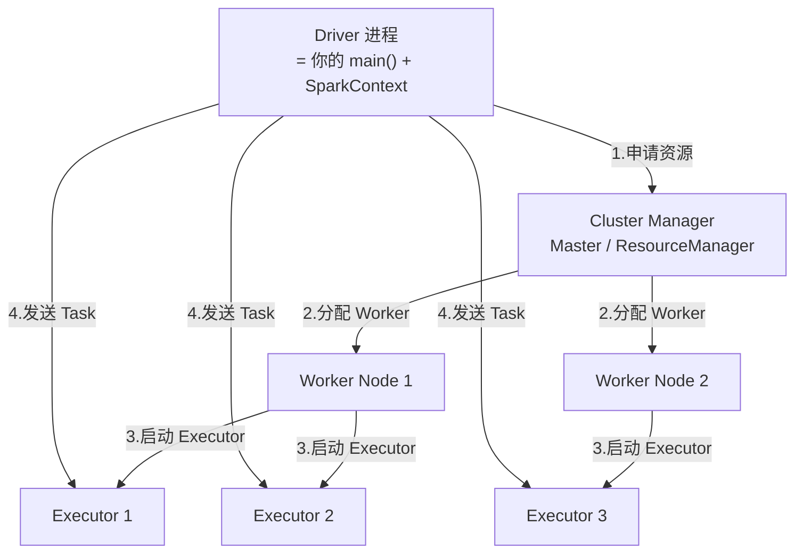

#### 🔵 **Driver(驾驶员)**
- 用户编写的 `main()` 函数跑在这里
- 内部创建 **SparkContext / SparkSession**(整个应用的入口)
- 三大核心职责:
  1. **构建 DAG**:把用户的 RDD 算子翻译成逻辑执行计划
  2. **调度任务**:通过 DAGScheduler / TaskScheduler 把 Task 派发给 Executor
  3. **回收结果**:Action 算子触发后,从 Executor 拉回结果返回给用户
- 一个 Spark 应用 = 一个 Driver + 多个 Executor

#### 🟢 **Executor(执行器)**
- 真正干活的 JVM 进程,跑在 Worker 节点上
- 每个 Executor 内部有:
  - **多个 Task 线程**(一般每个核一个线程,并行跑 Task)
  - **BlockManager**:管理本节点的数据块(Shuffle 中间结果、缓存的 RDD 分区)
- 生命周期:从应用启动到结束,**长存**,适合做 RDD 缓存复用
- 负责**执行 Task + 存储数据**

#### 🟡 **Cluster Manager(集群管理器)**
- 负责**给 Driver 和 Executor 分配资源**(CPU、内存)
- Spark 自带 **Standalone**(类似简化版 YARN)
- 生产环境常用 **YARN** 或 **Kubernetes**

#### 🔴 **Master / Worker**(Standalone 专属)
- **Master**:类似 YARN 的 ResourceManager,管理整个集群
- **Worker**:类似 YARN 的 NodeManager,管理本节点的 Executor
- 在 YARN 模式下:**Master → ResourceManager**,**Worker → NodeManager**

#### ⚪ 三者关系一句话
> **Driver 是"大脑"**(调度),**Executor 是"手脚"**(执行),**Cluster Manager 是"HR"**(分配资源)。

---

### 3. 核心组件交互时序

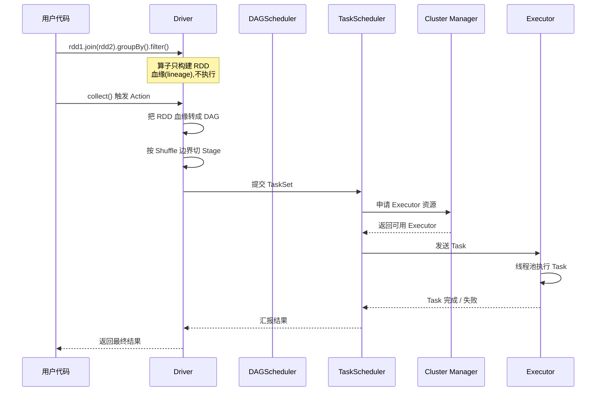

---

## RDD 核心概念

**RDD(Resilient Distributed Dataset,弹性分布式数据集)** 是 Spark 最核心的数据抽象。你可以把它理解成:

> **RDD = 一个分区的、只读的、可并行处理的数据集合 + 它怎么从其他 RDD 算出来的血缘(lineage)。**

### RDD 五大特性

| # | 特性 | 含义 |
|---|---|---|
| 1 | **A list of partitions** | 数据被切成多个分区(partition),每个分区是数据的一个子集 |
| 2 | **A function for computing each partition** | 每个分区都有一个 compute 函数,负责从父 RDD 算出当前分区 |
| 3 | **A list of dependencies on other RDDs** | 记录父 RDD 的依赖(窄依赖 / 宽依赖),用于容错 |
| 4 | **(Optional) A Partitioner for key-value RDDs** | KV 类型的 RDD 有分区器(如 HashPartitioner),决定数据落到哪个分区 |
| 5 | **(Optional) A list of preferred locations** | 每个分区有"最佳位置"列表(数据本地性,移动计算不移动数据) |

### 宽依赖 vs 窄依赖 ⭐⭐⭐

这是 Spark 调度最关键的概念:

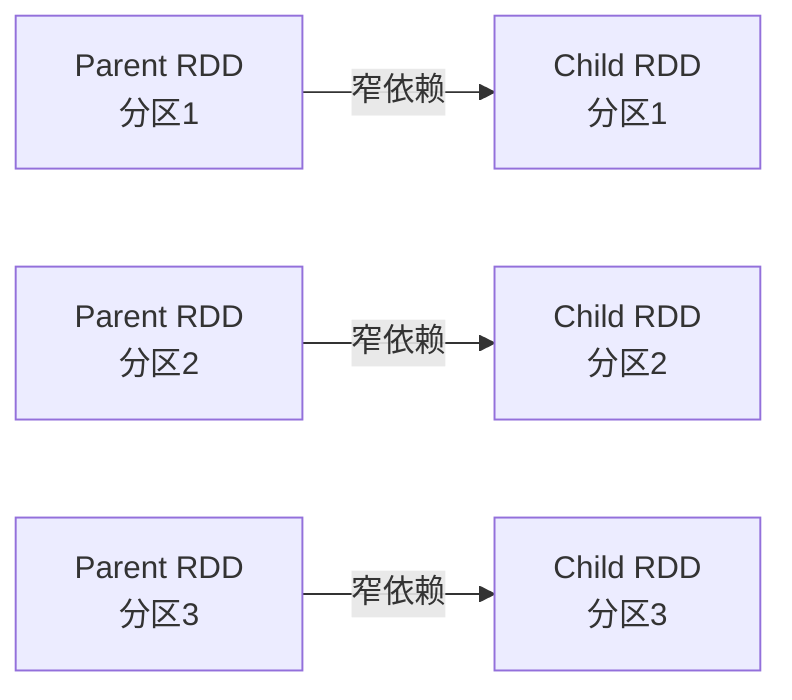

**窄依赖(Narrow Dependency)**:
- 父 RDD 的**每个分区**最多被 Child RDD 的**一个分区**使用
- 一对一(1:1)或部分聚合(多:1,如 `coalesce`)
- **不需要 Shuffle**,可以在同一个 Task 里 pipeline 完成
- 例:`map` / `filter` / `union` / `coalesce`

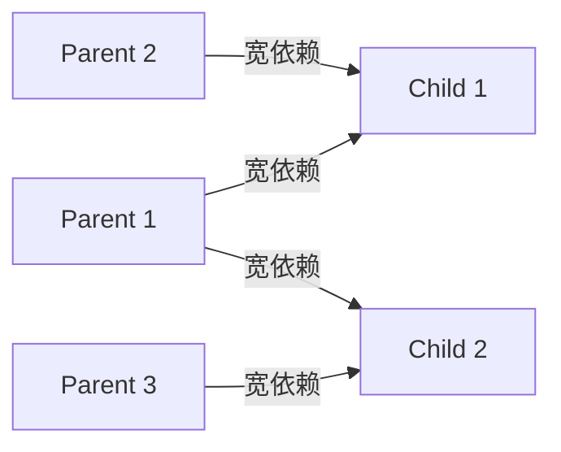

**宽依赖(Wide Dependency / Shuffle Dependency)**:
- 父 RDD 的**每个分区**可能被 Child RDD 的**多个分区**使用
- 跨节点数据传输,**产生 Shuffle**
- **Stage 划分的边界**:遇到宽依赖就切开!
- 例:`groupByKey` / `reduceByKey` / `join` / `repartition`

> **关键意义**:窄依赖可以在单个 Stage 内流水线执行,出错只需重算单个 Task;宽依赖会触发 Shuffle,产生 Stage 切分,开销大。

---

## Spark 运行流程

### 整体流程:从代码到执行

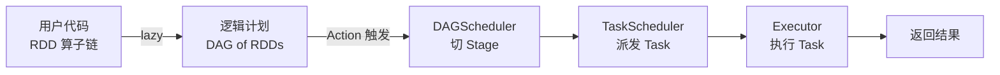

### Step 1️⃣ 构建 DAG

```scala
val rdd1 = sc.textFile("hdfs://...")     // 1个 RDD
val rdd2 = rdd1.flatMap(_.split(" "))    // 1个 RDD
val rdd3 = rdd2.map((_, 1))              // 1个 RDD
val rdd4 = rdd3.reduceByKey(_ + _)       // 1个 RDD ← 这里产生宽依赖!
val rdd5 = rdd4.filter(_._2 > 10)        // 1个 RDD
rdd5.collect()                            // 触发执行!
```

对应 DAG:

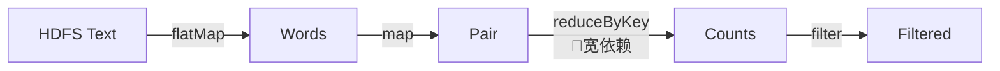

### Step 2️⃣ 划分 Stage

DAGScheduler 从后往前推,**遇到宽依赖就切一刀**:

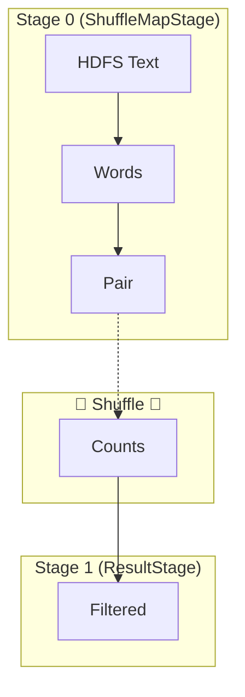

- **Stage 0**:从 HDFS 读到 reduceByKey 之前(ShuffleMapStage,产出 Shuffle 数据)
- **Stage 1**:从 reduceByKey 之后到 filter(读 Shuffle 数据 + 计算,ResultStage)
- **切分原则**:每个 Stage 内部全是窄依赖,可以 pipeline;Stage 之间用 Shuffle 衔接

### Step 3️⃣ 生成 Task 并调度

- 每个 Stage 内部的**每个分区**对应一个 **Task**
- 例:Stage 0 有 200 个分区 → 200 个 Task
- DAGScheduler 把 Task 打包成 **TaskSet** 交给 TaskScheduler
- TaskScheduler 通过 Cluster Manager 把 Task 发到 Executor 上执行

### Step 4️⃣ 执行并容错

- Task 在 Executor 线程里跑
- 失败的 Task 由 TaskScheduler 重试(默认重试 4 次)
- **Shuffle 失败**会重算对应 Stage 的所有 Task
- **整个 Stage 失败**会回传给 DAGScheduler,重新调度

---

## 核心概念关系全景图

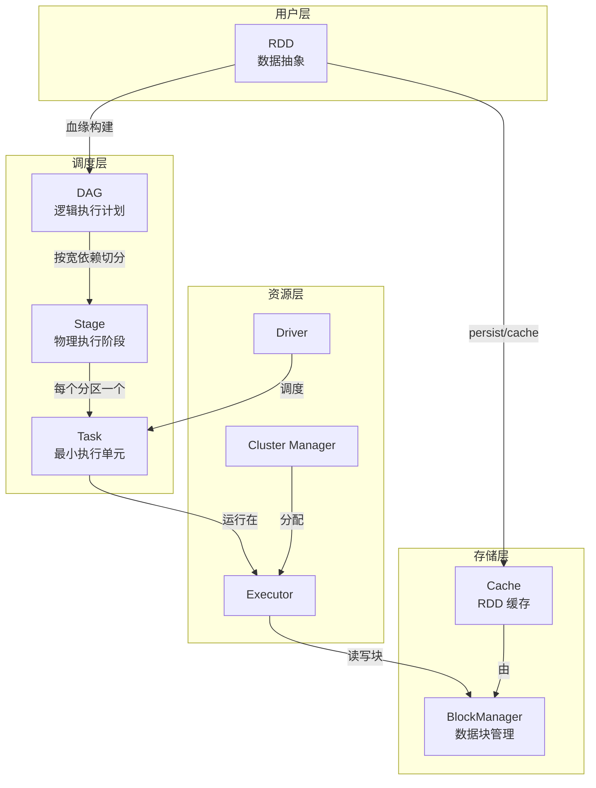

### 关键对应关系

| 抽象层 | 1 个 Spark 应用 | 1 个 Stage | 1 个 Task |
|---|---|---|---|
| **资源层** | 1 个 Driver + N 个 Executor | 在某个 Executor 上执行 | 在 Executor 的某个线程里跑 |
| **数据层** | 处理一个 Job 的全部数据 | 处理一个 Stage 内全部分区 | 处理一个分区的数据 |
| **数量关系** | 1 App : 1 Driver | 1 Stage : N Task(N = 分区数) | 1 Task : 1 Partition |

---

## Spark 的部署模式

| 模式 | Cluster Manager | Driver 运行位置 | 适用场景 |
|---|---|---|---|
| **Local** | 无(本地线程) | 本地 JVM | 开发调试 |
| **Standalone** | Spark 自带 Master | 客户端或集群 | 小集群演示 |
| **YARN-Client** | YARN | **客户端**(本地) | 调试,看日志方便 |
| **YARN-Cluster** | YARN | **ApplicationMaster 内** | 生产环境(Driver 也在集群) |
| **Mesos** | Mesos | 类似 YARN | 历史方案 |
| **Kubernetes** | K8s | Pod 内 | 云原生趋势,生产推荐 |

> 生产环境 99% 用 **YARN-Cluster** 或 **Kubernetes**。

---

## Spark on YARN 工作模式 ⭐⭐⭐

把 Spark 跑在 YARN 上是**生产环境最主流**的方案。要理解它,先把 YARN 的几个核心组件回顾一下:

| YARN 组件 | 职责 | 类比 |
|---|---|---|
| **ResourceManager (RM)** | 全局资源调度 | 大老板 |
| **NodeManager (NM)** | 单节点资源管理 | 部门主管 |
| **ApplicationMaster (AM)** | 单个应用的主控 | 项目经理 |
| **Container** | 任务运行的容器(资源 + JVM) | 装活儿的小盒子 |

---

### 1. YARN-Client 模式(用于调试)

**关键特征**:**Driver 跑在提交任务的客户端机器上**(本地 JVM,不在 YARN 集群里)。

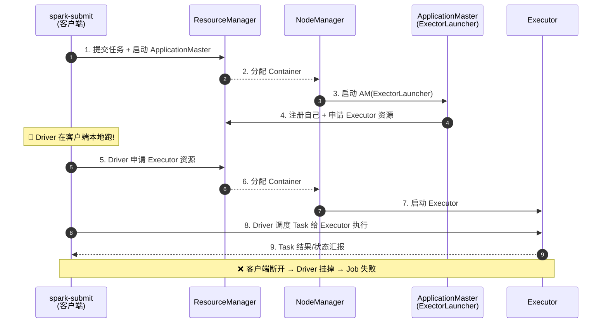

**特点速记**:
- ✅ **本地日志实时可见**,调试方便
- ✅ 适合 `spark-shell` / `pyspark` 交互式
- ❌ **客户端掉线 = Driver 死 = 任务全死**(无容错)
- ❌ 客户端和 YARN 集群之间产生**大量 RPC 网络交互**

---

### 2. YARN-Cluster 模式(生产首选) ⭐⭐⭐

**关键特征**:**Driver 跑在 ApplicationMaster 容器里**,整个应用全在 YARN 集群内运行。

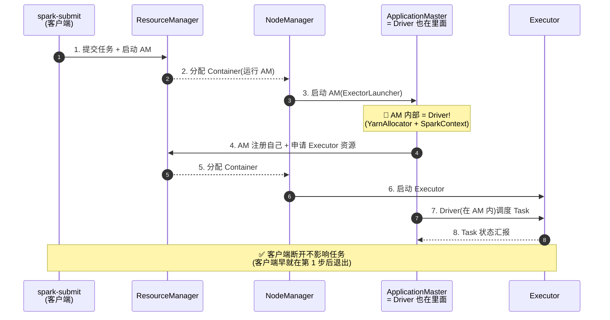

**特点速记**:
- ✅ **Driver 在集群内部**,客户端断网/关机不影响
- ✅ 适合**长时间运行的生产作业**
- ❌ 日志要去 YARN ApplicationMaster 页面看(`yarn logs -applicationId ...`)
- ❌ 不适合交互式场景

---

### 3. 两种模式核心区别对比

| 维度 | **YARN-Client** | **YARN-Cluster** |
|---|---|---|
| **Driver 位置** | 🖥️ 提交任务的**客户端机器** | 🏢 YARN 集群内的 **AM Container** |
| **Client 断开** | 💥 Job 立即挂掉 | ✅ Job 继续跑 |
| **YarnAllocator** | Driver 内部 | AM 内部(ExectorLauncher) |
| **网络通信** | Driver ↔ RM / NM / Executor 跨网段 | 全部在集群内,网络少一跳 |
| **日志查看** | 客户端 stdout 实时看 | `yarn logs -applicationId <id>` |
| **适合** | 开发调试 / 交互式 spark-shell | **生产批处理 / 长时间任务** |
| **提交命令示例** | `spark-submit --master yarn --deploy-mode client ...` | `spark-submit --master yarn --deploy-mode cluster ...` |

---

### 4. 一次完整的 YARN-Cluster 任务执行流程

把视角拉远,看从用户敲下回车到任务跑完的全过程:

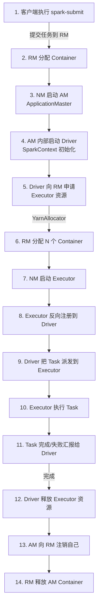

---

### 5. 关键角色对照表(Spark ↔ YARN)

| Spark 概念 | YARN 中对应 | 说明 |
|---|---|---|
| **Driver** | 跑在 **AM Container** 内 | 业务逻辑、调度 |
| **ApplicationMaster** | **ExectorLauncher**(YarnAM) | 申请/释放 Executor 资源 |
| **Executor** | 跑在 **Executor Container** 内 | 真正干活的 Task 进程 |
| **Spark Application** | 一个 **YARN Application** | 包含 1 个 AM + N 个 Executor Container |

> 💡 **关键洞察**:**YARN-Cluster 下,ApplicationMaster 是个"双重身份"**:
> 1. 对 YARN 来说它是 AM,负责和 RM 通信申请/释放 Container
> 2. 对 Spark 来说它是 Driver,负责调度 Task

---

### 6. 提交命令实操

```bash
# ===== Client 模式(调试用)=====
spark-submit \
  --master yarn \
  --deploy-mode client \
  --class com.example.WordCount \
  --driver-memory 1g \
  --executor-memory 2g \
  --executor-cores 2 \
  --num-executors 4 \
  /path/to/wordcount.jar

# ===== Cluster 模式(生产用)=====
spark-submit \
  --master yarn \
  --deploy-mode cluster \
  --class com.example.WordCount \
  --driver-memory 1g \
  --executor-memory 2g \
  --executor-cores 2 \
  --num-executors 4 \
  /path/to/wordcount.jar
```

**生产环境推荐参数**:

```bash
--driver-memory 2g          # Driver 给 2G(AM 内存)
--executor-memory 4g        # 每个 Executor 4G
--executor-cores 2          # 每个 Executor 2 个核
--num-executors 10          # 10 个 Executor → 总 80G 内存 / 20 核
--conf spark.yarn.maxAppAttempts=2    # 失败重试 2 次
--conf spark.yarn.submit.waitAppCompletion=true   # 等任务跑完再退出 CLI
```

---

### 7. 查看 YARN 上跑的任务

```bash
# 查看所有 Spark 应用
yarn application -list

# 查看某个应用的详细状态
yarn application -status application_1234567890_0001

# 查看日志(Cluster 模式必会)
yarn logs -applicationId application_1234567890_0001

# 杀掉跑挂的任务
yarn application -kill application_1234567890_0001

# Web UI
http://<rm-host>:8088        # ResourceManager UI
http://<nm-host>:8042        # NodeManager UI
```

---

### 8. 一句话记忆

> **YARN-Cluster = Driver 在 AM 里(集群内部,生产首选);YARN-Client = Driver 在客户端本地(调试首选,断网即死)**。两者唯一的本质区别就是 **Driver 跑在哪儿**。

---

## Spark 算子分类

### Transformation(转换算子)— 懒执行

| 类型 | 算子 | 说明 |
|---|---|---|
| 单 value | `map` / `filter` / `flatMap` / `sample` | 1 → 1 或 1 → N |
| 双 value | `union` / `intersection` / `subtract` / `cartesian` | 两个 RDD 组合 |
| KV 型 | `groupByKey` / `reduceByKey` / `sortByKey` / `join` | 按 key 处理 |
| 缓存型 | `cache` / `persist` / `checkpoint` | 把 RDD 持久化 |

### Action(动作算子)— 触发执行

| 算子 | 说明 |
|---|---|
| `collect` | 把数据拉回 Driver(小心 OOM!) |
| `count` | 计数 |
| `take(n)` | 取前 n 条 |
| `saveAsTextFile` | 存到 HDFS |
| `foreach` | 遍历(常用于写入外部存储) |
| `first` / `top` | 取首 / 取最大 |

### 关键原则 ⭐
> **Transformation 是 lazy 的**(只构建血缘,不算),**只有 Action 才会真正触发 Job 执行**。

---

## 一图总结

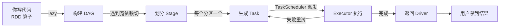

**Spark 调度的核心 = DAGScheduler 切 Stage,TaskScheduler 派 Task**。理解这两个 Scheduler 的分工,就理解了 Spark 的整个执行模型。