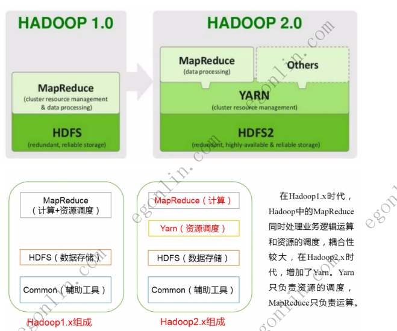
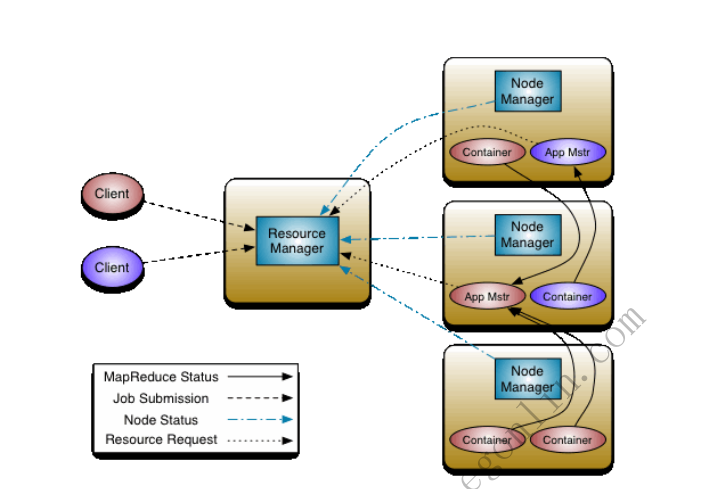
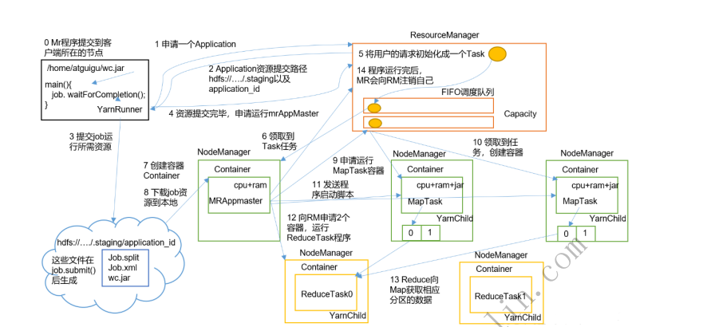

## 目录

| # | 章节 | 讲啥 |
|---|---|---|
| [1](#yarn-是什么) | **YARN 是什么** | Hadoop 的资源管理系统 |
| [2](#yarn-出现的背景) | **YARN 出现的背景** | Hadoop1.x 的痛点 |
| [3](#hadoop1x-与-hadoop2x-对比) | **Hadoop1.x 与 Hadoop2.x 对比** | 架构拆分前后 |
| [4](#yarn-的定位) | **YARN 的定位** | 通用的资源管理与调度框架 |
| [5](#yarn的三大核心构成) | **YARN 的三大核心构成** | RM / NM / AM + Container |
| [6](#yarn的工作流程) | **YARN 的工作流程** | 14 步流程详解 + 调度器 |

---

## YARN 是什么

**Apache YARN**(Yet Another Resource Negotiator 的缩写)是 hadoop 集群**资源管理系统**,它负责分配和管理集群中的资源。YARN 将集群资源视为一个资源池,并将应用程序所需的资源封装成**资源容器**(Resource Container),如内存、CPU 等。YARN 可以根据应用程序的需求动态地分配资源,使得集群资源得到最大化的利用。

## YARN 出现的背景

早期的 Hadoop 1.0 版本的**任务执行效率低下**,Hadoop 2.x 版本开始引入了 YARN 框架。YARN 框架为集群在利用率、资源统一管理和数据共享等方面带来了巨大好处。

## Hadoop1.x 与 Hadoop2.x 对比

### Hadoop1.x 架构

- **MapReduce**:计算 + 资源调度
- **HDFS**:数据存储
- **Common**:辅助工具

在 Hadoop 1.x 时代,Hadoop 中的 MapReduce 同时处理业务逻辑运算和资源的调度,耦合性较大。

### Hadoop2.x 架构

- **MapReduce**:只负责**计算**
- **YARN**:只负责**资源调度**
- **HDFS**:数据存储
- **Common**:辅助工具

在 Hadoop 2.x 时代,增加了 YARN。Yarn 只负责资源的调度,MapReduce 只负责运算。**职责分离**,各司其职。

| 维度 | Hadoop 1.x | Hadoop 2.x |
|---|---|---|
| 资源调度 | MapReduce 兼顾 | **YARN 独立负责** |
| 计算框架 | 只有 MapReduce | MapReduce + Others(Spark / Hive / Pig 等) |
| 存储 | HDFS | HDFS2(更高可用、更可靠) |
| 耦合度 | 高(MapReduce 又算又调度) | 低(资源调度与计算解耦) |

## YARN 的定位

Hadoop YARN 提供了一个**更加通用的资源管理和分布式应用框架**。该框架使用户可以**根据自己的需求实现定制化的数据处理应用**,

- ✅ **既可以支持 MapReduce 计算**
- ✅ **也可以很方便地管理如 Hive、HBase、Pig、Spark/Shark 等组件的应用程序**

YARN 的架构设计使得各类型的应用程序可以运行在 Hadoop 上,并通过 YARN 从系统层面进行统一管理。拥有了 YARN 框架,各种应用可以**互不干扰地运行在同一个 Hadoop 系统中**,以共享整个集群资源。
## YARN 三大核心构成

YARN 总体上是 Master / Slave 结构,在整个资源管理框架中,ResourceManager 为 Master,NodeManager 为 Slave,主要有以下几大核心组件:

### 1. ResourceManager(RM)

**ResourceManager**(简称 RM)是 YARN 的**集群资源管理器**,是整个集群的大脑,负责:

- 对**整个集群的资源进行统一管理和分配**
- 根据应用程序的需求,**为每个 ApplicationMaster 分配 Container**
- 处理来自客户端的请求
- 监控 NodeManager
- 启动/监控 ApplicationMaster

### 2. NodeManager(NM)

**NodeManager**是 YARN 中**运行在每个节点上的代理**,负责:

- 管理**单个节点上的资源**(CPU、内存、磁盘、网络等)
- 处理来自 ResourceManager 的命令
- 处理来自 ApplicationMaster 的命令
- 周期性地向 ResourceManager 汇报本节点上的**资源使用情况**和**各个 Container 的运行状态**

### 3. ApplicationMaster(AM)

**ApplicationMaster**是**应用程序级别的进程**,负责:

- 与 ResourceManager 协商,**为应用程序申请 Container 资源**
- 把获得的 Container 进一步分配给内部的**各个 Task**
- 与 NodeManager 通信,**启动/停止 Task**
- Task 失败时,重新为 Task 申请资源并重新启动 Task

每个应用程序(Job)都有自己的 AM,例如 MapReduce 任务的 MRAppMaster。

### 4. Container

**Container**是 YARN 中的**资源抽象**,封装了某个节点上的**多维度资源**(如内存、CPU、磁盘、网络等)。

- 当 AM 向 RM 申请资源时,RM 为 AM 返回的资源便是用 **Container** 表示的
- YARN 会为每个任务分配一个 **Container**,该任务只能使用该 Container 中描述的资源
- Container 不同于我们以前看到的 Docker 容器,它**仅仅是一个资源抽象的逻辑概念**,不提供任何语言隔离性
## yarn的工作流程

下面以一个 **MapReduce 任务**为例,详细拆解 YARN 的工作流程(共 14 步):

### 步骤拆解

| 步骤 | 角色 | 动作 |
|---|---|---|
| **0** | Client | MR 程序提交到客户端所在的节点 |
| **1** | Client → RM | 客户端向 **ResourceManager** **申请一个 Application** |
| **2** | RM → Client | RM 响应,给客户端一个**提交路径**(`hdfs://.../staging`)以及 `application_id` |
| **3** | Client → HDFS | 客户端将 **job 资源**(job.split / job.xml / wc.jar)**提交到 HDFS 路径**下 |
| **4** | Client → RM | 资源提交完毕,正式**申请运行 MRAppMaster** |
| **5** | RM 内部 | RM 将用户的请求**初始化成一个 Task**,放入调度队列(**FIFO / Capacity** 等) |
| **6** | RM → NM | **某个 NodeManager 领取到该 Task 任务** |
| **7** | NM | **创建 Container**(包含 cpu + ram 资源) |
| **8** | NM | 下载 job 资源到本地 |
| **9** | NM | 在 Container 中**启动 MRAppMaster** |
| **10** | RM → NM | **NM 领取到任务,创建容器**(用于后续 MapTask / ReduceTask) |
| **11** | MRAppMaster → RM | MRAppMaster **向 RM 申请运行 MapTask 的容器** |
| **12** | MRAppMaster | 向对应的 NodeManager **发送程序启动脚本**(启动 YarnChild 跑 MapTask) |
| **13** | Reduce | ReduceTask 向已完成的 **MapTask 拉取对应分区的数据** |
| **14** | RM | 程序运行结束后,MRAppMaster 会**向 RM 注销自己**,释放 Container |

### 三大调度队列(第 5 步)

YARN 提供三种**资源调度器**,常用的是:

- **FIFO Scheduler** — 先来先服务,最简单但不灵活
- **Capacity Scheduler** — 容量调度,Yahoo 出品,**默认采用**,按队列划分资源
- **Fair Scheduler** — 公平调度,Facebook 出品,资源在队列间按需分配

### 一句话总结

> **Client 提交 → RM 分配 Container → NM 拉起 MRAppMaster → MRAppMaster 再向 RM 申请 Container → 起 Map / Reduce 跑 YarnChild → 跑完 AM 注销。**